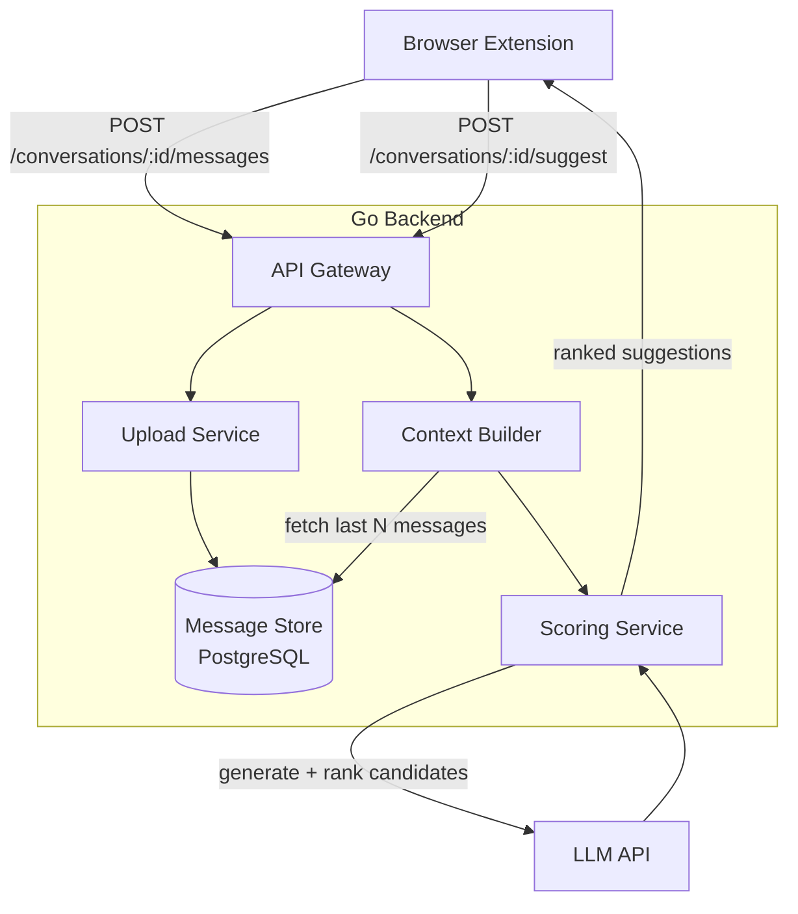

# chatfish

Chatfish reads your Telegram conversations, stores them for context, and scores reply suggestions using an LLM — like Stockfish, but for chat.

## Architecture



## Services

| Service | Responsibility |
|---|---|
| `upload` | Receive messages from client, persist to store |
| `store` | Hold conversation history, provide context window |
| `scoring` | Build prompt from context, call LLM, rank candidates |
| `api` | HTTP layer tying everything together |

## Development

```bash
# Run locally
go run .

# Run tests
go test ./...

# Build binary
go build -o chatfish .
```

```bash
# Build Docker image
docker build -t chatfish .

# Run container
docker run -p 8080:8080 chatfish

# Test the server
curl localhost:8080/ping
```

## Stack

- **Backend**: Go
- **Storage**: PostgreSQL (conversation history) + Redis (session/context cache)
- **AI**: LLM for reply generation and scoring (OpenAI / Anthropic / Ollama)
- **Deployment**: Docker, cloud-ready
